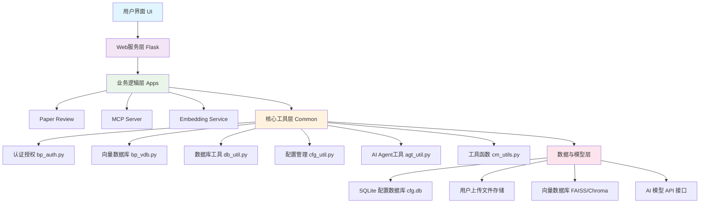

# 系统架构文档

## 1. 系统概述

本系统是一个基于 Python 和 Flask 的多功能 AI 应用平台，主要包含以下几个核心模块：

- **AI Agent 平台**: 提供多种 AI 能力的集成和调度，包括 LLM、ASR、OCR 等。
- **Paper Review 应用**: 利用 AI 能力实现文档智能评审功能。
- **向量数据库 (VDB) 管理**: 支持文档向量化存储与检索。
- **用户认证与权限管理**
- **数据库配置管理**

## 2. 整体架构图

```txt
+------------------+ +--------------------+
| 用户界面(UI) | <---> | Web服务层(Flask) |   
+------------------+ +--------------------+   
|   
+----------v-----------+   
| 业务逻辑层(Apps) |   
| - Paper Review |   
| - MCP Server |  
| - Embedding Service |  
+----------+-----------+   
|   
+-------------v--------------+   
| 核心工具层(Common) |   
| - 认证授权 (bp_auth.py) |   
| - 向量数据库 (bp_vdb.py) |   
| - 数据库工具 (db_util.py) |   
| - 配置管理 (cfg_util.py) |   
| - AI Agent 工具 (agt_util.py)|   
| - 工具函数 (cm_utils.py) |   
+-------------+--------------+   
|   
+---------------v-----------------+   
| 数据与模型层 |   
| - SQLite 配置数据库 (cfg.db) |   
| - 用户上传文件存储 |   
| - 向量数据库 (FAISS/Chroma) |   
| - AI 模型 API 接口 |   
+---------------------------------+  
```



## 3. 主要组件详解

### 3.1 Web服务层

使用 Flask 框架构建，负责处理 HTTP 请求和响应。

- **主应用入口**: [apps/*/app.py](~/llm_agent/apps/csm/app.py) (如 [apps/paper_review/app.py](~/llm_agent/apps/paper_review/app.py))
- **静态资源**: 存放在 `static` 目录下，包括 CSS、JavaScript 和前端模板
- **模板引擎**: 使用 Jinja2 渲染 HTML 页面

### 3.2 业务逻辑层

根据不同应用场景划分为独立的应用模块。

#### 3.2.1 Paper Review 应用 (`apps/paper_review`)

- **功能**: 实现文档智能评审功能
- **核心流程**:
  1. 用户上传评审标准（Excel/Word）和评审材料（Word）
  2. 系统将文档转换为 Markdown 格式
  3. 调用 AI Agent 进行分章节评审
  4. 生成并展示评审报告
- **关键文件**:
  - [agent.py](~/llm_agent/apps/eval_expert/agent.py): 核心评审逻辑实现
  - [paper_review_util.py](~/llm_agent/apps/paper_review/paper_review_util.py): 评审专用工具函数
  - [app.py](~/llm_agent/apps/csm/app.py): Web服务接口实现

#### 3.2.2 其他潜在应用

- **MCP Server**: 可能是用于模型控制协议的服务
- **Embedding Service**: 提供文本向量化服务

### 3.3 核心工具层 (`common`)

这是系统的核心支撑库，提供了各种通用工具和服务。

#### 3.3.1 认证与授权

涉及文件 ([bp_auth.py](~/llm_agent/common/bp_auth.py))

- 用户注册、登录验证
- Session管理
- 权限控制

#### 3.3.2 向量数据库管理   

涉及文件 ([bp_vdb.py](~/llm_agent/common/bp_vdb.py), [vdb_util.py](~/llm_agent/common/vdb_util.py), [vdb_hf_util.py](~/llm_agent/common/vdb_hf_util.py))

- 文档向量化处理
- 向量数据库创建与维护
- 相似性搜索功能

#### 3.3.3 数据库工具 

涉及文件 ([db_util.py](~/llm_agent/common/db_util.py))

- 支持多种数据库连接（SQLite, MySQL, Oracle, DM8等）
- 统一的数据访问接口
- SQL执行与结果处理

#### 3.3.4 配置管理

涉及文件 ([cfg_util.py](~/llm_agent/common/cfg_util.py), `cfg_db_schema/`)

- 使用 SQLite 作为系统配置数据库
- 管理用户信息、数据源配置、缓存设置等
- 提供加密/解密功能保护敏感信息

#### 3.3.5 AI Agent 工具

涉及文件 ([agt_util.py](~/llm_agent/common/agt_util.py))

- 与大语言模型交互的封装
- Prompt模板管理
- 会话信息抽取、订单信息提取等功能

#### 3.3.6 通用工具函数

涉及文件 ([cm_utils.py](~/llm_agent/common/cm_utils.py))

- 网络请求封装
- 字符串处理
- 错误重试机制

### 3.4 数据与模型层

#### 3.4.1 配置数据库

涉及文件 ([cfg.db](~/llm_agent/apps/chat/cfg.db))

采用 SQLite 存储系统配置信息，主要包括以下表：

- [user](~/llm_agent/apps/embedding/app.py#L50-L50): 系统用户信息
- `db_config`: 数据源配置
- `vdb_info`: 向量数据库元信息
- `vdb_file_info`: 向量数据库中的文件信息
- `docx_file_info`: Word文档任务信息
- `cache_info`: 缓存配置
- `const`: 常量配置

#### 3.4.2 文件存储

- **用户上传文件**: 存储在各应用的 `upload_doc` 目录下
- **向量数据库**: 使用 FAISS 或 Chroma 存储向量化后的文档

#### 3.4.3 AI 模型接口

通过 `RESTful` API 与外部的大语言模型、语音识别等AI服务进行交互。

## 3.5 数据存储模块  
### 3.5.1 元数据管理 

涉及文件 (docx_meta_util.py)
```python
class MetaDataManager:
    - save_docx_file_info(): 保存任务元数据
    - get_docx_file_info(): 获取任务信息
    - get_user_task_list(): 获取用户任务列表
    - update_process_info(): 更新处理进度
    - save_output_file_path_by_task_id(): 保存输出文件路径
```
### 3.5.2 数据库设计  
docx_file_info表：  

```sql
CREATE TABLE docx_file_info (
    id INTEGER PRIMARY KEY,
    uid INTEGER,                    -- 用户ID
    task_id INTEGER,               -- 任务ID
    doc_type TEXT,                 -- 文档类型
    doc_title TEXT,                -- 文档标题
    keywords TEXT,                 -- 关键词/评审要求
    template_path TEXT,            -- 模板文件路径
    vdb_id INTEGER,               -- 向量数据库ID
    is_include_para_txt INTEGER,  -- 是否包含段落文本
    create_time TEXT,             -- 创建时间
    process_info TEXT,            -- 处理信息
    percent INTEGER,              -- 处理进度
    file_path TEXT,               -- 输出文件路径
    word_count INTEGER,           -- 字数统计
    outline TEXT,                 -- 文档大纲
    img_count INTEGER             -- 图片数量
);
```
docx_para_info表：

```sql
CREATE TABLE docx_para_info (
    id INTEGER PRIMARY KEY,
    task_id INTEGER,              -- 任务ID
    para_id INTEGER,              -- 段落ID
    heading TEXT,                 -- 标题
    unique_key TEXT,              -- 唯一标识
    write_context TEXT,           -- 写作上下文
    paragraph_prompt TEXT,        -- 段落提示
    user_comment TEXT,            -- 用户评论
    catalogue TEXT,               -- 目录信息
    current_sub_title TEXT,       -- 当前子标题
    vdb_dir TEXT,                 -- 向量数据库目录
    namespaces TEXT,              -- 命名空间
    gen_txt TEXT,                 -- 生成文本
    status INTEGER                -- 状态
);
```
## 3.6 配置管理模块 

涉及文件 (sys_init.py)  
职责：系统配置加载和管理  

核心功能：

```python
def init_yml_cfg(cfg_file="cfg.yml") -> dict:
    - YAML配置文件解析
    - 单例模式确保配置唯一性
    - 环境变量支持
```
配置文件结构：

```yaml
api:
  llm_api_key: "your-api-key"
  llm_model_name: "gpt-3.5-turbo"
  llm_api_uri: "https://api.openai.com/v1"
database:
  db_file: "app.db"
upload:
  max_file_size: 10485760  # 10MB
  allowed_extensions: [".docx", ".xlsx"]
```
## 4. 部署架构

### 4.1 容器化部署

- 使用 Docker 进行容器化部署
- 构建脚本位于 `build/` 目录下
- [Dockerfile_py](~/llm_agent/common/build/Dockerfile_py) 定义了 Python 环境的构建过程

### 4.2 服务启动

- [boot.sh](~/llm_agent/common/boot.sh): 主启动脚本，根据应用类型选择不同的启动方式（Gunicorn/Uvicorn）
- [start.sh](~/llm_agent/common/start.sh): 开发环境下的启动脚本

## 5. 安全设计

- **用户认证**: 用户名密码登录，Session管理
- **通信安全**: 支持 HTTPS 协议
- **数据安全**: 敏感信息（如数据库密码）进行加密存储
- **API安全**: 使用 Token 进行 API 访问控制

## 6. 性能考量

- **并发处理**: 使用多线程处理耗时任务（如文档向量化）
- **缓存机制**: 对频繁访问的数据进行缓存
- **异步处理**: 长时间运行的任务在后台线程中执行
- **进度追踪**: 提供任务进度反馈机制

## 7. 可扩展性设计

- **模块化设计**: 不同功能模块相对独立，易于扩展
- **插件化架构**: 支持新增不同类型的AI服务能力
- **配置驱动**: 大部分行为可通过配置文件调整
