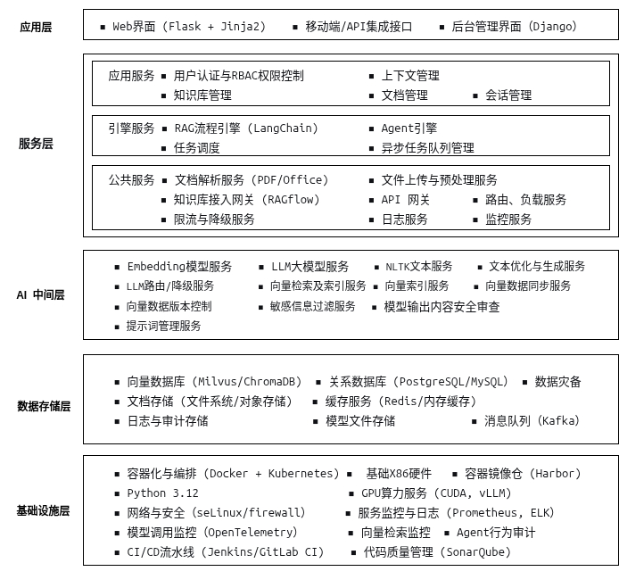

# 架构文档

## 1. 项目概述

本项目是一个基于大语言模型（LLM）的智能代理系统，提供多种AI服务，包括知识库问答、数据库查询、文档生成、客服辅助等功能。系统采用模块化设计，支持HTTP/HTTPS协议，可通过Docker容器化部署。

## 2. 系统架构

### 2.1 整体架构

系统采用分层架构设计，如图 2-1所示。

（1）**应用层**。包含多个独立的应用模块，每个模块提供特定的功能，由Web 界面， 移动端/API 接口，以及后台管理界面。

（2）**服务层**。提供核心的公共服务组件，如用户认证于权限控制、会话于上下文管理等。

（3）**AI 中间层**。 提供基础人工智能能力服务， 如 Embedding模型服务， LLM 大模型服务，视觉达模型服务， 向量检索服务， NLTK文本处理服务，和提示词管理等。

（4）**数据存储层**。提供接口级的数据存储服务，包括传统的关系型数据，以及向量数据库数据访问服务， 文档存储服务、缓存服务、日志于审计服务，以及模型文件管理服务。

（5）**基础设施层**。 基础设施层提供整个系统运行的基础环境，包括基础硬件以及硬件虚拟化服务，同时提供基础的网络与安全服务（如安全内和加固、IP访问白名单控制、网络路由控制等），支持服务的监控和日常日志的收集管理和查询。

<b>图 2-1 系统结构示意图</b>

### 2.2 核心模块

#### 2.2.1 应用模块

- **chat2db**：支持自然语言查询数据库（MySQL, Oracle, DM8）。
- **docx**：提供文档生成功能，支持Word模板上传和自动生成。
- **llm**：兼容OpenAI接口的大语言模型服务。
- **embedding**：兼容OpenAI接口的文本嵌入模型服务。
- **portal**：集成所有应用的入口地址，提供统一导航。

#### 2.2.2 公共组件

- **cfg_util.py**：配置管理工具，支持从YAML文件和SQLite数据库读取配置。
- **db_util.py**：数据库操作工具，支持多种数据库连接和操作。
- **vdb_util.py**：向量数据库操作工具，支持文本向量化和检索。

### 2.3 数据存储

- **SQLite配置数据库**：存储运行时参数和配置信息。
- **向量数据库**：用于存储和检索文本向量。
- **本地文件存储**：存储日志、模板文件等。

## 3. 部署架构

系统支持以下部署方式：

1. **本地开发模式**：通过IDE（如PyCharm、VSCode）直接启动调试。
2. **Docker容器化部署**：提供Dockerfile和打包脚本，支持一键部署。
3. **HTTPS服务**：通过Nginx反向代理提供HTTPS服务。

## 4. 依赖关系

- **Python 3.12**：主要开发语言。
- **SQLite**：轻量级配置数据库。
- **Chroma**：向量数据库。
- **Docker**：容器化部署工具。

## 5. 扩展性

系统设计支持以下扩展方向：

1. **新增应用模块**：通过标准化接口快速集成新功能。
2. **多语言支持**：扩展接口层以支持多语言调用。
3. **分布式部署**：通过微服务架构实现水平扩展。

## 6. 安全设计

- **输入验证**：对所有输入数据进行严格验证。
- **HTTPS支持**：通过Nginx配置HTTPS加密传输。
- **日志审计**：记录所有操作日志，支持安全审计。

## 7. 性能优化

- **异步处理**：支持多线程和异步任务处理。
- **缓存机制**：对频繁访问的数据进行缓存。
- **资源监控**：动态监控线程池和内存使用情况。

## 8. 未来计划

1. **支持更多数据库**：扩展`chat2db`模块以支持更多数据库类型。
2. **增强文档生成功能**：支持更多文档格式和模板。
3. **优化性能**：进一步优化向量检索和模型推理性能。